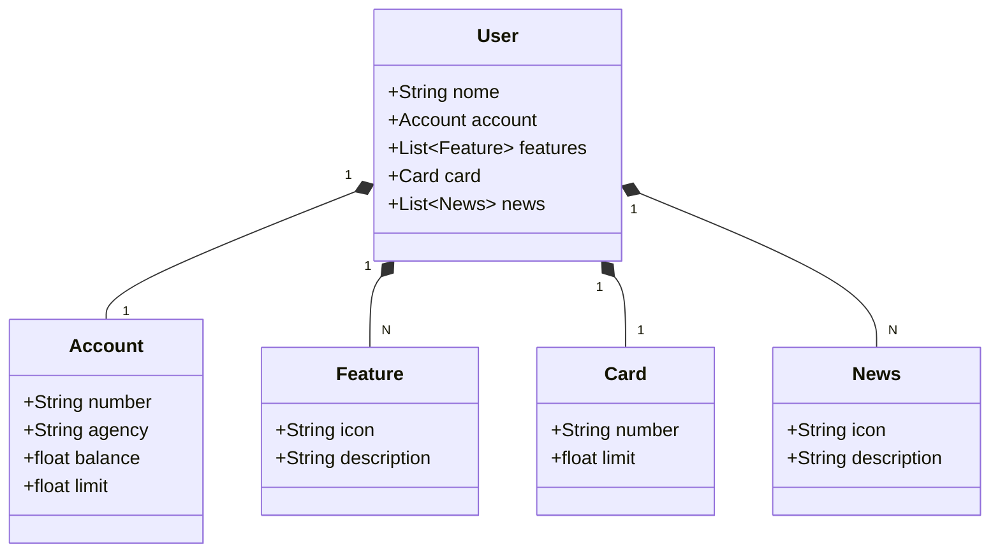

#Santander-Dev-Week
API Rest na Nuvem Usando Spring Boot 3 e Java 17

##  Diagrama de classes

```mermaid
classDiagram
    class User {
        +String nome
        +Account account
        +List~Feature~ features
        +Card card
        +List~News~ news
    }

    class Account {
        +String number
        +String agency
        +float balance
        +float limit
    }

    class Feature {
        +String icon
        +String description
    }

    class Card {
        +String number
        +float limit
    }

    class News {
        +String icon
        +String description
    }

    User "1" *-- "1" Account
    User "1" *-- "N" Feature
    User "1" *-- "1" Card
    User "1" *-- "N" News
```
